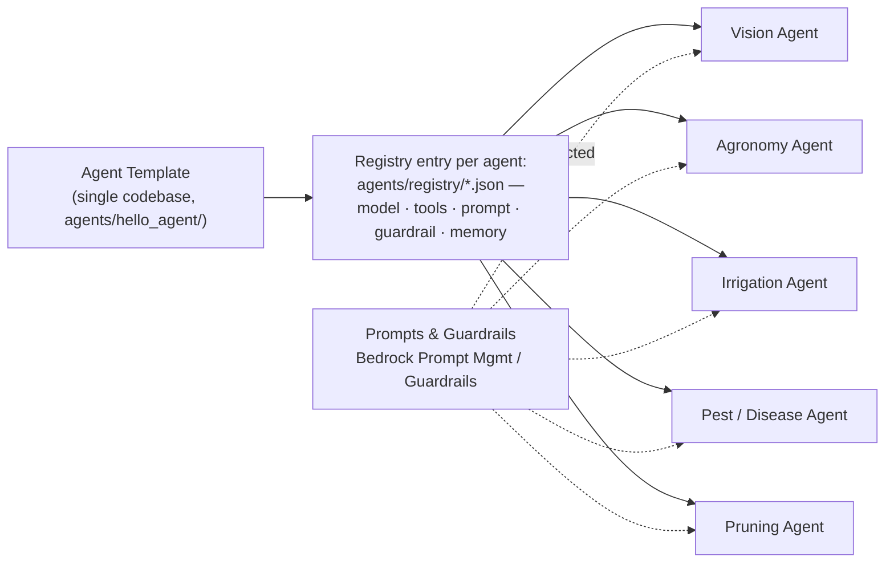
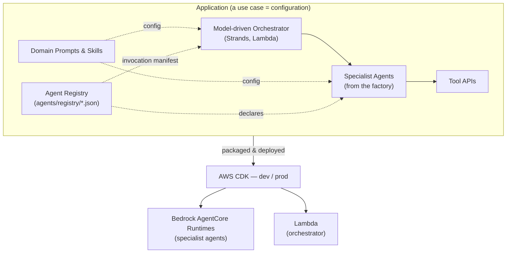
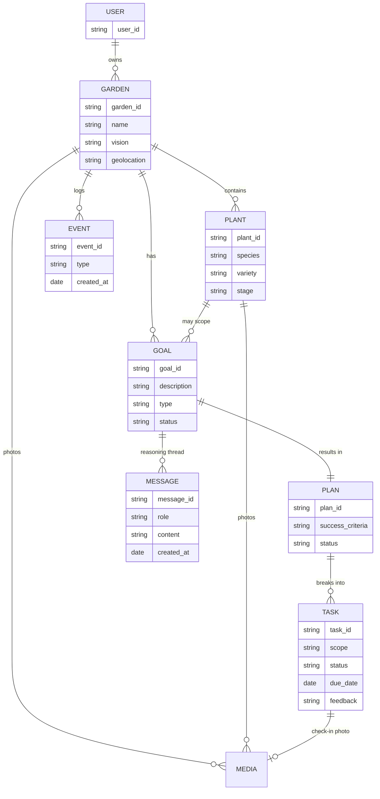
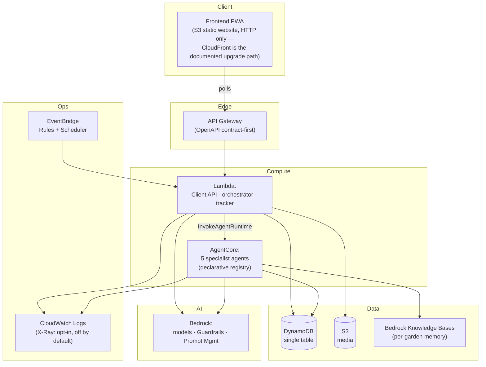
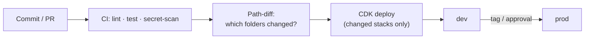
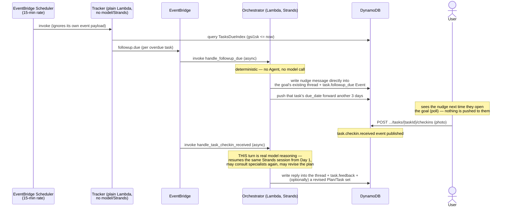
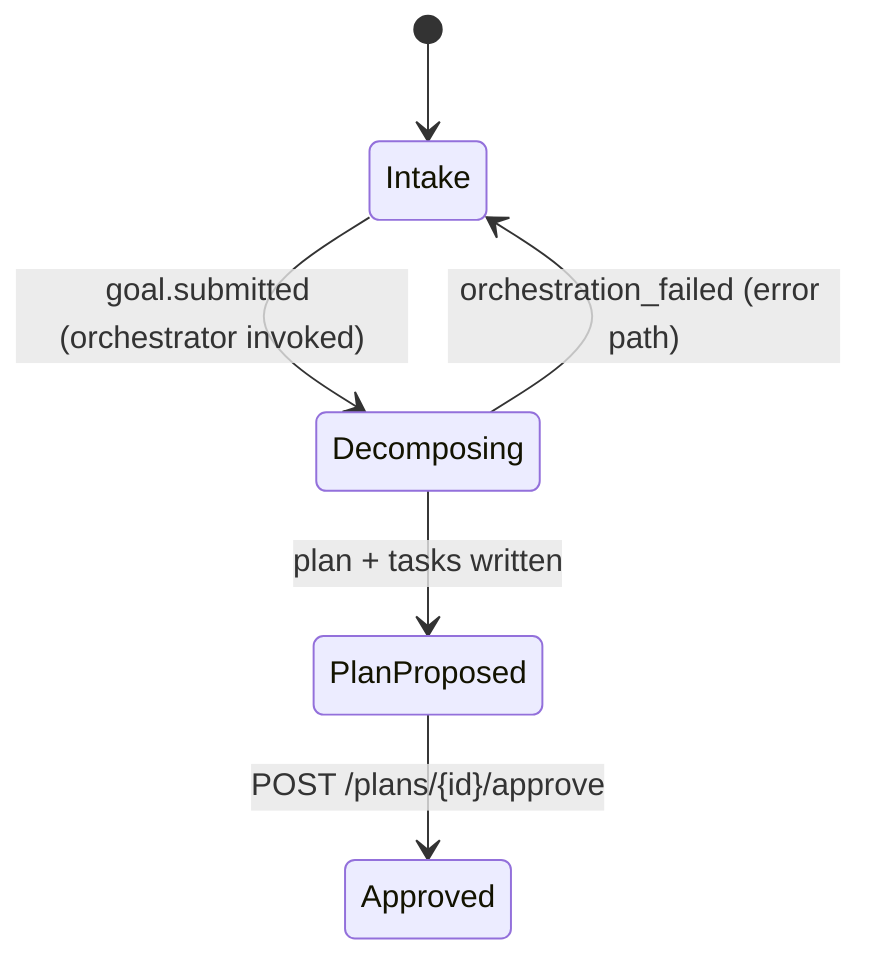

# Tendril — Architecture

This document describes Tendril's **conceptual architecture** and its **engineering views**. Tendril is built in two layers — a domain-agnostic **framework** and a garden **application** built on it (see [`../project-context.md`](../project-context.md)). Key decisions are recorded as ADRs in [`./ADRs/`](./ADRs/).

---

## 1. Concept Architecture

### 1.1 Build-time: Template → Agent → Application

A single **Agent Template** (one codebase) is specialized into many agents purely by **configuration** — model, tools, prompt/skill, guardrails, memory, and context settings. Prompts and skills live outside the code in **Bedrock Prompt Management / S3**, so each specialty can be authored and versioned independently by its domain expert.



5 specialists are deployed today (one AgentCore runtime each, all sharing the one template
codebase above); adding a 6th is a new `agents/registry/*.json` entry, never new agent code.

The specialized agents, the model-driven orchestrator, the tool bindings, and the domain prompts are composed into an **Application** and deployed via **AWS CDK** to **dev** and **prod**.



Which specialist agents exist is **declarative, deploy-time configuration** — a JSON file per
agent in `agents/registry/` (same policy-as-data convention as `guardrails/*.json` and
`prompts/*.md`), read by CDK to provision AgentCore runtimes *and* by the orchestrator to build
its invocation manifest, so the two can never disagree (see [ADR-0012](./ADRs/0012-orchestrator-lambda-declarative-agent-registry.md)).

### 1.2 Runtime: model-driven composition

At runtime there is **no fixed execution order**. The orchestrator (Strands) decides, per request and garden context, which specialists and tools to invoke and in what sequence; specialists exchange information to reach the best course of action.

```mermaid
flowchart LR
  U["User<br/>(Angular PWA)"] --> API["Client API<br/>(API Gateway + Lambda,<br/>OpenAPI contract-first)"]
  API --> S3[("S3<br/>media")]
  API --> DDB[("DynamoDB<br/>domain state + events")]
  API -. async event .-> EB["EventBridge"]
  EB --> ORCH["Orchestrator<br/>(Strands on Lambda)"]
  ORCH -->|InvokeAgentRuntime| SPEC["Specialist Agents<br/>(AgentCore runtimes,<br/>declarative registry)"]
  ORCH --> TOOLS["Tool APIs"]
  SPEC --> TOOLS
  TOOLS --> WX["Weather"]
  ORCH --> DDB
  SPEC --> MEM["Per-garden memory<br/>(Bedrock Knowledge Base)"]
  SCHED["Tracker<br/>(plain Lambda, scheduled)"] -->|reads TasksDueIndex| DDB
  SCHED -. followup.due .-> EB
  ORCH -->|writes nudge directly into<br/>the goal's chat thread| DDB
  U -->|polls| API
  GRD["Bedrock Guardrails"] -. applied per call .-> SPEC
  CW["CloudWatch Logs<br/>(X-Ray: opt-in, off by default)"] -. observes .-> ORCH
```

The orchestrator is **Lambda-hosted and async, event-triggered** — it runs off the Client API's
request path (matching ADR-0004's push-based design for long-running agent work), not on
AgentCore. Specialist agents remain on AgentCore, invoked dynamically by the orchestrator's
Strands agent loop via `InvokeAgentRuntime` (see [ADR-0012](./ADRs/0012-orchestrator-lambda-declarative-agent-registry.md)).

**No push channel exists yet** — no WebSocket, no WhatsApp/SMS/email, no web-push. A proactive
follow-up is a plain chat message the Tracker/orchestrator write directly into the goal's
existing message thread; the gardener sees it the next time the app polls or is opened. A
`ConnectionsTable` for a future WebSocket channel is provisioned (`infra/stacks/foundation_stack.py`)
but nothing writes to or reads from it yet — a genuine, tracked gap, not a design choice.

---

## 2. Application Domain Model

The user's world is a small set of entities. DynamoDB is the structured source of truth (see [ADR-0002](./ADRs/0002-context-management-and-durable-state.md)). For the concrete `pk`/`sk` design, GSIs, session/memory keying, the agent data-access boundary, and a full Lambda/API/Agent/Event/Data inventory, see [`data-architecture.md`](./data-architecture.md).



- **Scope of a Task** is either **plant-level** or **garden-level** (part or whole garden).
- **EVENT** is the capture-first activity-tab log (`goal.submitted`, `plan.approved`,
  `task.checkin`, `task.followup_due`, ...).
- **MESSAGE** is the per-goal reasoning thread the orchestrator resumes across turns (initial
  diagnosis, chat replies, proactive nudges, check-in feedback) — it is the real mechanism behind
  what earlier drafts of this doc called "tracking."
- `USER` today is just the anonymous `X-User-Id` header value (ADR-0004) — no channel/locale
  fields are actually stored anywhere; there is no separate User record, only the
  `USER#{id}/GARDEN#{id}` ownership index (`data-architecture.md` §2).

---

## 3. Services

| Service | Responsibility | Tech | Deploy target |
|---------|----------------|------|---------------|
| **Client API** | The one Lambda (`app/api/garden_handler.py`) behind every user-facing endpoint: gardens, plants, media, goals, messages, check-ins, plan approval, tasks, activity — **OpenAPI 3.x contract-first** ([ADR-0011](./ADRs/0011-openapi-contract-first-client-api.md)) | API Gateway + Lambda | Lambda |
| **Orchestrator** | Model-driven decomposition & composition of specialists/tools; async, event-triggered ([ADR-0012](./ADRs/0012-orchestrator-lambda-declarative-agent-registry.md)) | Strands | Lambda |
| **Specialist Agents** | Domain expertise — **5 deployed today**: vision, agronomy, irrigation, pest/disease, pruning; declared in `agents/registry/*.json` | Strands (factory) | AgentCore |
| **Tracker / Scheduler** | Plain boto3 Lambda (no model, no Strands) — polls a DynamoDB GSI for overdue tasks and emits `followup.due`; the orchestrator's `handle_followup_due` then writes a deterministic nudge straight into the goal's chat thread (no external send) | EventBridge Scheduler + Lambda | Lambda |
| **Tool APIs** | Weather (real, Lambda behind an IAM-authenticated Function URL) — the only tool deployed today; the pattern is designed to add more without touching agent code | Lambda | Lambda |
| **Memory / Knowledge** | Real per-garden memory — a Bedrock Knowledge Base (S3 Vectors backend) each specialist retrieves/ingests against, wired into the shared agent template, not the orchestrator | Bedrock Knowledge Bases | Managed |
| **Persistence** | Structured domain state + event/message log, single table | DynamoDB | Managed |
| **Frontend** | Angular PWA — 8 routed screens behind a responsive shell ([ADR-0003](./ADRs/0003-frontend-angular-and-design-system.md), §8 below) | Angular | S3 static website ([ADR-0010](./ADRs/0010-frontend-hosting-s3-static-website.md)) |

**Not built yet** (documented gaps, not oversights): a Notification service and any push channel
(WebSocket/WhatsApp/email/web-push) — today every follow-up is a chat message the gardener sees
on their next poll, never sent anywhere externally. A `ConnectionsTable` for a future WebSocket
channel exists in `foundation_stack.py` but nothing reads or writes it yet.

---

## 4. APIs

### 4.1 Client API (user-facing)

Defined **contract-first** in OpenAPI 3.x ([ADR-0011](./ADRs/0011-openapi-contract-first-client-api.md)) —
`app/api/openapi.yaml` is the source of truth; API Gateway (`SpecRestApi`) is provisioned by
importing it directly, and the frontend's TypeScript types are generated from the same file.

| Endpoint | Method | Purpose |
|----------|--------|---------|
| `/gardens` | POST, GET | Create a garden (name, geolocation); list the caller's gardens |
| `/gardens/{gardenId}` | GET | Read garden context |
| `/gardens/{gardenId}/weather` | GET | Real current weather for the garden's geolocation |
| `/gardens/{gardenId}/media` | POST | Get a presigned upload URL + create the Media record |
| `/gardens/{gardenId}/plants` | POST, GET | Add / list plants (with photos) |
| `/gardens/{gardenId}/plants/{plantId}` | DELETE | Remove a plant |
| `/gardens/{gardenId}/goals` | POST, GET | Submit an issue (async — 202, orchestrator decomposes it); list goals |
| `/gardens/{gardenId}/goals/{goalId}` | GET | Goal + plan + tasks + media + full message thread |
| `/gardens/{gardenId}/goals/{goalId}/messages` | POST | Send a chat message on an existing goal (async) |
| `/gardens/{gardenId}/goals/{goalId}/tasks/{taskId}/checkins` | POST | Attach a check-in photo, mark the task done (async feedback) |
| `/gardens/{gardenId}/plans/{planId}/approve` | POST | Human-in-the-loop plan approval (sync, no model call) |
| `/gardens/{gardenId}/tasks` | GET | All tasks across every goal in the garden |
| `/gardens/{gardenId}/activity` | GET | The garden's event timeline, newest first |

No `PATCH`/update endpoints and no `/status` endpoint exist — garden/plan/task status is read
back through the endpoints above, never written directly by the client. Full request/response
shapes are the source-of-truth `app/api/openapi.yaml`, not this table.

### 4.2 Tool APIs (agent-facing, "tools are APIs")

| Tool | Purpose | Consumer | Status |
|------|---------|----------|--------|
| Weather | Forecast for the garden's geolocation, called via an IAM-authenticated Lambda Function URL | vision, irrigation, and pruning agents (per `agents/registry/*.json`'s per-agent `tools` list) | **Built** |
| Knowledge base retrieve/ingest | Per-garden memory | Every specialist (`memory.enabled: true` in its registry entry) | **Built** — via the Strands `MemoryManager`/`BedrockKnowledgeBaseStore` in the shared agent template, not a separate "tool" the model calls explicitly |

Species ID and pest/disease diagnosis from a photo is **not** a separate tool call — the vision
specialist receives the image directly as multimodal model input. A Nursery/Market pricing tool
and a Notification-send tool are natural future additions (same uniform-contract pattern), but
neither exists today.

### 4.3 Orchestrator ↔ Specialist invocation

Specialists aren't called over a conventional network API — each one is exposed to the
orchestrator's Strands agent loop as an **agent-as-tool**, whose implementation calls AgentCore's
`InvokeAgentRuntime` against that specialist's deployed runtime
([ADR-0012](./ADRs/0012-orchestrator-lambda-declarative-agent-registry.md)). *Which* specialists
exist is declared in `agents/registry/*.json` — read by `AgentCoreStack` to provision runtimes
and by the orchestrator to build its invocation manifest at deploy time, so provisioning and
invocation can never drift apart. *Which* of the declared specialists the model actually calls,
and in what order, is still decided at runtime — the declarative part is existence, not
sequencing (ADR-0001's "no fixed execution order" is unchanged).

---

## 5. Configurability

The framework's value is that behavior is **configuration**, not code.

| Configurable | Where | Examples |
|--------------|-------|----------|
| **Agent specialization** | `cdk.json` / env + Bedrock Prompt Management | model id, tool list, prompt/skill, guardrail, memory & context settings |
| **Agent registry** | `agents/registry/*.json` | which specialist agents are deployed, their AgentCore runtime name, and the tool description the orchestrator's model sees ([ADR-0012](./ADRs/0012-orchestrator-lambda-declarative-agent-registry.md)) |
| **Application composition** | App config | tool bindings, orchestrator policy, persona/context weighting |
| **API contract** | `app/api/openapi.yaml` | Client API request/response shapes, generated frontend types ([ADR-0011](./ADRs/0011-openapi-contract-first-client-api.md)) |
| **Prompts & skills** | Bedrock Prompt Management / S3 | authored & versioned per specialty by domain experts |
| **Guardrails** | Bedrock Guardrails | domain safety, content, PII policies |
| **Environment** | CDK context | `dev` / `prod` names, accounts, regions, removal policies |
| **Model per agent** | Agent config | Claude for reasoning; specialized vision model for diagnosis (see [ADR-0001](./ADRs/0001-use-strands-agents-framework.md)) |

Adding a specialty = a new prompt + a config entry. Adding a use case = a new configuration bundle; the engine is unchanged.

---

## 6. Engineering Views

### 6.1 Deployment view



Orchestrator and specialists are separate compute targets: **Lambda** (Client API, orchestrator,
tracker) calls **AgentCore** (specialist agents only) via `InvokeAgentRuntime`
([ADR-0012](./ADRs/0012-orchestrator-lambda-declarative-agent-registry.md)). There is no
WebSocket/push edge component — the frontend polls the Client API (see §7.1's note).

### 6.2 Delivery view (GitOps + selective deploy)

Monorepo; CI detects changed folders and deploys **only** those via CDK; `main` is deployable; CI authenticates to AWS via OIDC (no static keys). Serverless-only for a NoOps posture. Details in [`../engineering-best-practices.md`](../engineering-best-practices.md).



### 6.3 Cross-cutting concerns

- **Security:** IAM roles (no long-lived keys), secrets in Secrets Manager/SSM, Bedrock Guardrails, least-privilege tool permissions. The orchestrator's execution role is scoped to `bedrock-agentcore:InvokeAgentRuntime` on registered specialist runtime ARNs only.
- **Observability:** CloudWatch Logs on every Lambda and AgentCore runtime; X-Ray tracing is
  wired into `AgentCoreStack` but **off by default** in dev, opt-in via CDK context
  (`--context tracing=true`), since enabling it requires the account's X-Ray trace-segment
  destination to be set to CloudWatch Logs first.
- **Multi-tenancy:** memory/storage stores and DynamoDB keys scoped per user/garden.
- **Data & privacy:** capture-first event log with privacy-by-design (consent, PII minimization, retention/TTL).
- **Contract governance:** the Client API contract (`app/api/openapi.yaml`) and the agent registry (`agents/registry/*.json`) are both **data, not code** — reviewed in PRs the same way guardrails and prompts already are ([ADR-0011](./ADRs/0011-openapi-contract-first-client-api.md), [ADR-0012](./ADRs/0012-orchestrator-lambda-declarative-agent-registry.md)).

---

## 7. Use-Case Views (dynamic workflow & state)

### 7.1 Goal intake → dynamic decomposition → plan approval

No predefined order; the model composes the path and specialists exchange information.

```mermaid
sequenceDiagram
  actor User
  participant API as Client API (Lambda)
  participant EB as EventBridge
  participant Orch as Orchestrator (Lambda, Strands)
  participant Vis as Vision (AgentCore)
  participant Irr as Irrigation (AgentCore)
  participant Wx as Weather (Tool)
  participant State as DynamoDB
  User->>API: POST /goals — issue + photo ("lower leaves browning")
  API->>State: persist Goal (status=Intake) + Media
  API->>EB: goal.submitted event
  API-->>User: 202 Accepted, status=Intake
  EB->>Orch: invoke (async)
  Orch->>Vis: InvokeAgentRuntime: analyze photo
  Vis-->>Orch: "crispy lower leaves — inconsistent soil moisture"
  Note over Orch: model chooses next steps at runtime —<br/>not every issue needs a second specialist (registry's<br/>per-agent tools list decides which ones even *can* call weather)
  Orch->>Irr: InvokeAgentRuntime: watering guidance?
  Irr->>Wx: forecast (irrigation's registry entry lists the weather tool)
  Irr-->>Orch: water only when top inch of soil is dry
  Orch->>State: write Plan + Tasks + specialist trace (status=PlanProposed)
  User->>API: GET /goals/{goalId} (polling — no push channel exists)
  API-->>User: plan + trace once ready
  User->>API: POST /plans/{planId}/approve
  API->>State: Plan & Goal = Approved; stamp each pending Task's due_date (+3 days)
```

### 7.2 Long-running tracking loop (pause / resume across sessions)



### 7.3 Goal / Plan lifecycle (states)



These are the **only** four `Goal`/`Plan` status values any real code ever writes
(`app/orchestrator/orchestrator.py`, `app/api/garden_handler.py`) — a task's own lifecycle is
just `pending`/`done` (no due-date once `done`). A richer lifecycle
(`InProgress`/`AwaitingUser`/`Adapting`/`Completed`/`Abandoned`) was sketched early on and never
implemented; `InProgress` survives only as a frontend-only display bucket
(`home.component.ts`'s `IN_PROGRESS_STATUSES` treats `Approved` as "in progress" for UI grouping)
— the backend never actually emits it. Today, "done" is implicit: once every task under a plan
is checked in, nothing marks the Goal itself `Completed` — this is a real, open gap, not a
documented non-goal.

---

## 8. Frontend

The Angular PWA ([ADR-0003](./ADRs/0003-frontend-angular-and-design-system.md)) implements the
"Tendril App" design across 8 routed screens behind a responsive shell, deployed as a static
site ([ADR-0010](./ADRs/0010-frontend-hosting-s3-static-website.md)).

### 8.1 Screens & shell

| Screen | Route | Purpose |
|---|---|---|
| Garden setup | `/garden-setup` | First-run onboarding — name, geolocation, optional photo |
| Home | `/home` | Weather chip, pending-plan banner, today's tasks, goals in progress, plants strip |
| Add plant | `/add-plant` | Record a species/variety/photo, linked to the current garden (OB-02) |
| Check a plant | `/capture` | Photo + description → real goal submission against the Client API |
| Goal detail | `/goals/:goalId` | Plan approval (HITL), collapsible specialist trace, plan tasks, full reasoning thread, check-in |
| Tasks | `/tasks` | Grouped Today / This week / Later task lists |
| Garden | `/garden` | Garden hero photo/facts + full plant list, entry point to Add plant |
| Activity | `/activity` | Real event timeline (the EVENT entity, §2) |

Desktop (≥900px) gets a persistent nav rail; narrower viewports get a bottom tab bar with a
floating capture action — one `LayoutService` breakpoint
(`frontend/src/app/core/services/layout.service.ts`) drives both, via Angular CDK's
`BreakpointObserver`.

### 8.2 Data layer seam

Every screen reads through a small set of DI-swappable service interfaces
(`GardenApi`/`GoalApi`/`TaskApi`/`ActivityApi` in `frontend/src/app/core/services/`), bound in
`app.config.ts` to real `Http*Api` implementations that call the live Client API over HTTP
(`HttpGardenApi`, `HttpGoalApi`, `HttpTaskApi`, `HttpActivityApi`) — this seam
([ADR-0011](./ADRs/0011-openapi-contract-first-client-api.md)) is what let the real backend land
with no component changes. `Mock*Api` implementations still exist and are used only for the
pre-onboarding case (no garden created yet); a couple of narrow reads without a backend yet
(`getGardenFacts` — e.g. climate zone) also still fall back to mock data.

Goal-detail polls `GET /goals/{goalId}` on a 2-second interval while a goal is in a
not-yet-settled state — there is no WebSocket/push channel (§6.1), so this is the only way the
UI learns a plan or a check-in reply has arrived.

### 8.3 Design system

Tokens (`frontend/src/app/styles/_tokens.scss`) are CSS custom properties — light theme only for
now (dark theme, per ADR-0003, is roadmap). Angular Material/CDK are used for primitives
(`BreakpointObserver`, a11y) rather than restyled visual components; the visual design is custom,
matching the source design mockup.

### 8.4 Hosting

Static build (`ng build`) synced to S3 static website hosting on every push touching
`frontend/**` ([ADR-0010](./ADRs/0010-frontend-hosting-s3-static-website.md)) — plain HTTP for
now, so the PWA service worker doesn't register in production yet (a known, accepted trade-off;
CloudFront is the documented upgrade path).

---

## 9. Related documents

- Concept & vision: [`../project-context.md`](../project-context.md)
- Engineering standards: [`../engineering-best-practices.md`](../engineering-best-practices.md)
- Decisions: [ADR-0001 (framework)](./ADRs/0001-use-strands-agents-framework.md), [ADR-0002 (context & state)](./ADRs/0002-context-management-and-durable-state.md), [ADR-0003 (frontend)](./ADRs/0003-frontend-angular-and-design-system.md), [ADR-0004 (backend API)](./ADRs/0004-backend-api-serverless-storage.md), [ADR-0005 (AgentCore deploy)](./ADRs/0005-agentcore-deployment-via-cdk.md), [ADR-0006 (prompt externalization)](./ADRs/0006-prompt-externalization-bedrock-prompt-management.md), [ADR-0007 (prompt/skill versioning)](./ADRs/0007-prompt-skill-versioning-long-running-tasks.md), [ADR-0008 (guardrails)](./ADRs/0008-guardrails-layered-defense-in-depth.md), [ADR-0009 (AWS Agent Toolkit dev tooling)](./ADRs/0009-aws-agent-toolkit-dev-tooling.md), [ADR-0010 (frontend hosting)](./ADRs/0010-frontend-hosting-s3-static-website.md), [ADR-0011 (OpenAPI contract-first)](./ADRs/0011-openapi-contract-first-client-api.md), [ADR-0012 (orchestrator + agent registry)](./ADRs/0012-orchestrator-lambda-declarative-agent-registry.md), [ADR-0013 (agent data-access boundary)](./ADRs/0013-agent-data-access-boundary.md), [ADR-0014 (Lambda container images)](./ADRs/0014-lambda-container-image-packaging.md), [ADR-0015 (IoT actuation + HITL, future/proposed)](./ADRs/0015-iot-actuation-and-human-in-the-loop.md)
- [Strands capability mapping](./strands-capability-mapping.md): Strands SDK capabilities mapped to Tendril's functional/non-functional requirements, docs-verified (supersedes ADR-0001 Appendix A)
- [Data architecture](./data-architecture.md): entity/key design, session/context/memory management, the agent data-access boundary, and the full Lambda/API/Agent/Event/Data component inventory
