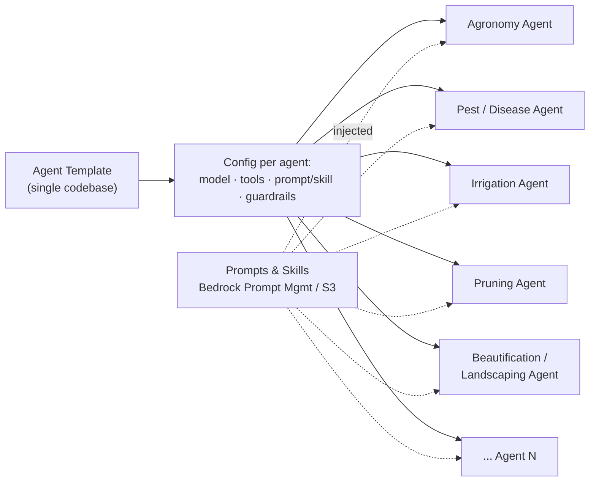
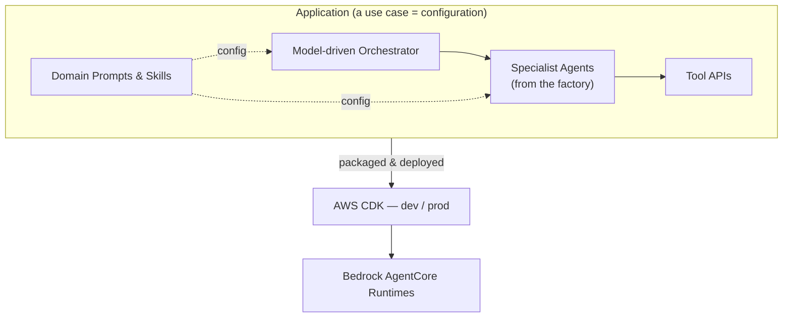
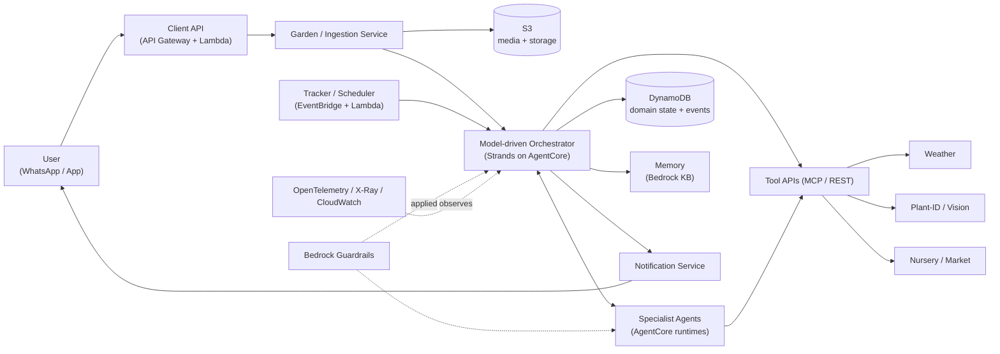
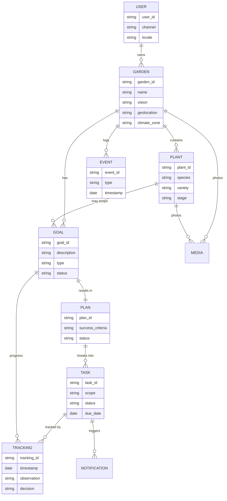
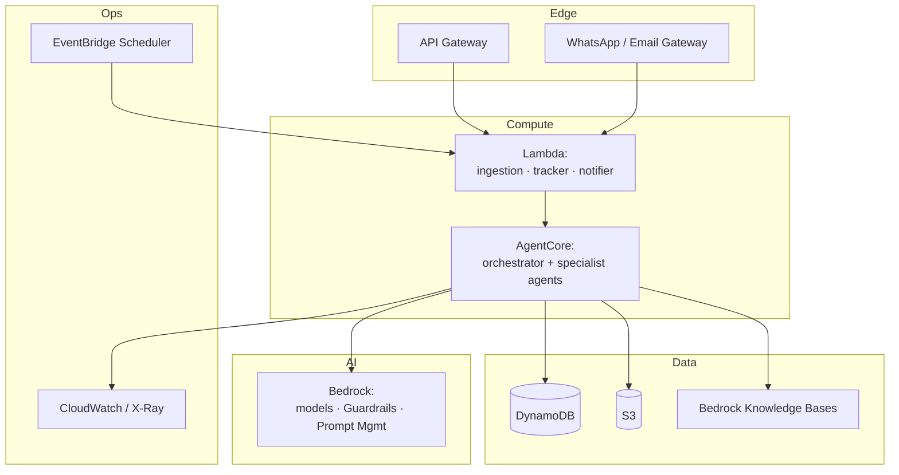
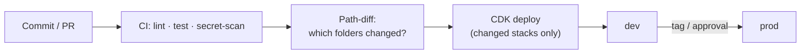
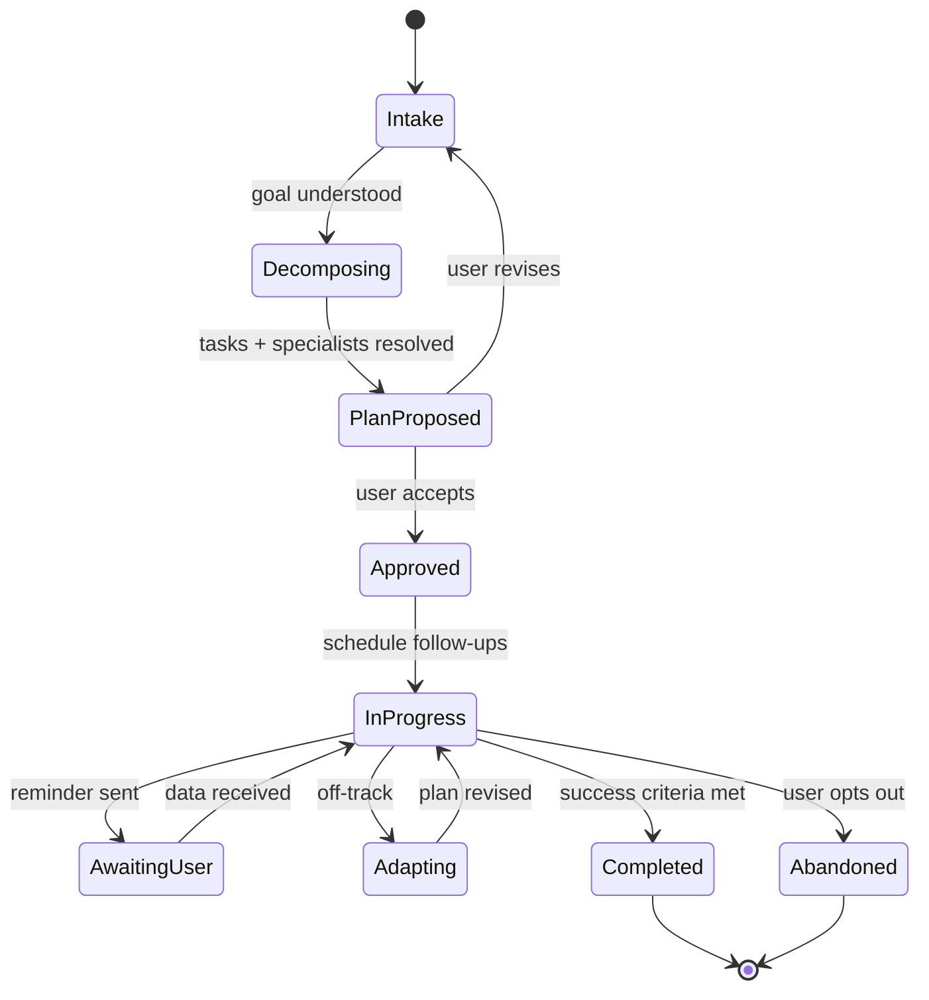

# Tendril — Architecture

This document describes Tendril's **conceptual architecture** and its **engineering views**. Tendril is built in two layers — a domain-agnostic **framework** and a garden **application** built on it (see [`../project-context.md`](../project-context.md)). Key decisions are recorded as ADRs in [`./ADRs/`](./ADRs/).

---

## 1. Concept Architecture

### 1.1 Build-time: Template → Agent → Application

A single **Agent Template** (one codebase) is specialized into many agents purely by **configuration** — model, tools, prompt/skill, guardrails, memory, and context settings. Prompts and skills live outside the code in **Bedrock Prompt Management / S3**, so each specialty can be authored and versioned independently by its domain expert.



The specialized agents, the model-driven orchestrator, the tool bindings, and the domain prompts are composed into an **Application** and deployed via **AWS CDK** to **dev** and **prod**.



### 1.2 Runtime: model-driven composition

At runtime there is **no fixed execution order**. The orchestrator (Strands) decides, per request and garden context, which specialists and tools to invoke and in what sequence; specialists exchange information to reach the best course of action.



---

## 2. Application Domain Model

The user's world is a small set of entities. DynamoDB is the structured source of truth (see [ADR-0002](./ADRs/0002-context-management-and-durable-state.md)).



- **Scope of a Task** is either **plant-level** or **garden-level** (part or whole garden).
- **EVENT** is the capture-first log that feeds the future data flywheel.

---

## 3. Services

| Service | Responsibility | Tech | Deploy target |
|---------|----------------|------|---------------|
| **Client API** | User-facing entry: gardens, plants, photos, goals, plan approval, status | API Gateway + Lambda | Lambda |
| **Garden / Ingestion** | Create/describe gardens; accept photos & metadata; build initial context | Lambda + S3 | Lambda |
| **Orchestrator** | Model-driven decomposition & composition of specialists/tools | Strands | AgentCore |
| **Specialist Agents** | Domain expertise (agronomy, pest, disease, irrigation, fertilizer, pruning, weather, beautification, landscaping) | Strands (factory) | AgentCore |
| **Tracker / Scheduler** | Drive the outcome loop: due follow-ups, reminders, re-evaluation | EventBridge + Lambda | Lambda |
| **Notification** | Outbound reminders & inbound replies (WhatsApp / email) | Lambda + provider | Lambda |
| **Media / Vision** | Plant-ID and photo diagnosis (specialized model or API tool) | Bedrock / external model | Tool API |
| **Memory / Knowledge** | Semantic garden history & horticultural knowledge | Bedrock Knowledge Bases | Managed |
| **Persistence** | Structured domain state + event log | DynamoDB | Managed |

---

## 4. APIs

### 4.1 Client API (user-facing)

| Endpoint | Method | Purpose |
|----------|--------|---------|
| `/gardens` | POST | Create a named garden (vision, geolocation) |
| `/gardens/{id}` | GET/PATCH | Read/update garden context |
| `/gardens/{id}/plants` | POST/GET | Add / list plants (with photos) |
| `/gardens/{id}/media` | POST | Upload a plant/garden photo |
| `/gardens/{id}/goals` | POST | Submit a concern / expectation / wish |
| `/plans/{id}/approve` | POST | Human-in-the-loop plan approval |
| `/gardens/{id}/tasks` | POST/GET | Create / list plant- or garden-level tasks |
| `/gardens/{id}/status` | GET | Progress, upcoming follow-ups, history |

### 4.2 Tool APIs (agent-facing, "tools are APIs")

| Tool | Purpose | Consumer |
|------|---------|----------|
| Weather | Forecast & climate for the garden's geolocation | Orchestrator, weather/irrigation/pruning agents |
| Plant-ID / Vision | Species ID and disease/pest diagnosis from photos | Diagnosis agent |
| Nursery / Market | Availability & prices of inputs/plants | Landscaping / procurement |
| Notification | Send reminders, collect replies | Tracker, orchestrator |
| Knowledge search | Retrieve grounded horticultural references | All specialists |

All tools sit behind a uniform contract (MCP / REST) so they are discoverable and swappable.

---

## 5. Configurability

The framework's value is that behavior is **configuration**, not code.

| Configurable | Where | Examples |
|--------------|-------|----------|
| **Agent specialization** | `cdk.json` / env + Bedrock Prompt Management | model id, tool list, prompt/skill, guardrail, memory & context settings |
| **Application composition** | App config | which agents exist, tool bindings, orchestrator policy, persona/context weighting |
| **Prompts & skills** | Bedrock Prompt Management / S3 | authored & versioned per specialty by domain experts |
| **Guardrails** | Bedrock Guardrails | domain safety, content, PII policies |
| **Environment** | CDK context | `dev` / `prod` names, accounts, regions, removal policies |
| **Model per agent** | Agent config | Claude for reasoning; specialized vision model for diagnosis (see [ADR-0001](./ADRs/0001-use-strands-agents-framework.md)) |

Adding a specialty = a new prompt + a config entry. Adding a use case = a new configuration bundle; the engine is unchanged.

---

## 6. Engineering Views

### 6.1 Deployment view



### 6.2 Delivery view (GitOps + selective deploy)

Monorepo; CI detects changed folders and deploys **only** those via CDK; `main` is deployable; CI authenticates to AWS via OIDC (no static keys). Serverless-only for a NoOps posture. Details in [`../engineering-best-practices.md`](../engineering-best-practices.md).



### 6.3 Cross-cutting concerns

- **Security:** IAM roles (no long-lived keys), secrets in Secrets Manager/SSM, Bedrock Guardrails, least-privilege tool permissions.
- **Observability:** built-in OpenTelemetry + X-Ray traces; CloudWatch for tool latency, token/cost, and error rates.
- **Multi-tenancy:** memory/storage stores and DynamoDB keys scoped per user/garden.
- **Data & privacy:** capture-first event log with privacy-by-design (consent, PII minimization, retention/TTL).

---

## 7. Use-Case Views (dynamic workflow & state)

### 7.1 Goal intake → dynamic decomposition → plan approval

No predefined order; the model composes the path and specialists exchange information.

```mermaid
sequenceDiagram
  actor User
  participant API as Client API
  participant Orch as Orchestrator (Strands)
  participant Diag as Diagnosis / Vision
  participant Pest as Pest
  participant Agro as Agronomy
  participant Wx as Weather API
  participant State as DynamoDB
  User->>API: Submit goal + photo ("leaves curling")
  API->>Orch: goal + garden context
  Orch->>Diag: analyze photo
  Diag-->>Orch: "aphids, mild + N imbalance?"
  Note over Orch: model chooses next steps at runtime
  Orch->>Pest: organic remedy for aphids?
  Orch->>Wx: forecast for spray timing
  Pest-->>Orch: neem-oil plan
  Wx-->>Orch: dry next 3 days
  Orch->>Agro: nutrient check (yellowing)
  Agro-->>Orch: reduce nitrogen, add compost
  Note over Orch,Agro: inter-agent exchange reconciles<br/>remedy + weather + nutrition
  Orch->>State: save proposed plan + success criteria
  Orch-->>User: Propose plan (HITL confirm)
  User-->>Orch: Approve
  Orch->>State: plan = Approved; schedule follow-ups
```

### 7.2 Long-running tracking loop (pause / resume across sessions)

```mermaid
sequenceDiagram
  participant Sched as Tracker / Scheduler
  participant Orch as Orchestrator
  participant State as DynamoDB
  participant Notif as Notification
  actor User
  Sched->>Orch: wake (follow-up due, plan X)
  Orch->>State: load plan, progress, success criteria
  Orch->>Notif: "Send a photo of the new leaves"
  Notif->>User: WhatsApp reminder
  Note over Orch: session ends; compute reclaimed
  User->>Notif: replies with a photo
  Notif->>Orch: resume (interrupt response)
  Orch->>Orch: re-evaluate vs success criteria
  alt Improved
    Orch->>State: mark milestone / complete
    Orch->>Notif: "Great progress!"
  else Not improved
    Orch->>State: adapt plan
    Orch->>Notif: revised guidance
  end
```

### 7.3 Goal / Plan lifecycle (states)



---

## 8. Related documents

- Concept & vision: [`../project-context.md`](../project-context.md)
- Engineering standards: [`../engineering-best-practices.md`](../engineering-best-practices.md)
- Decisions: [ADR-0001 (framework)](./ADRs/0001-use-strands-agents-framework.md), [ADR-0002 (context & state)](./ADRs/0002-context-management-and-durable-state.md)
