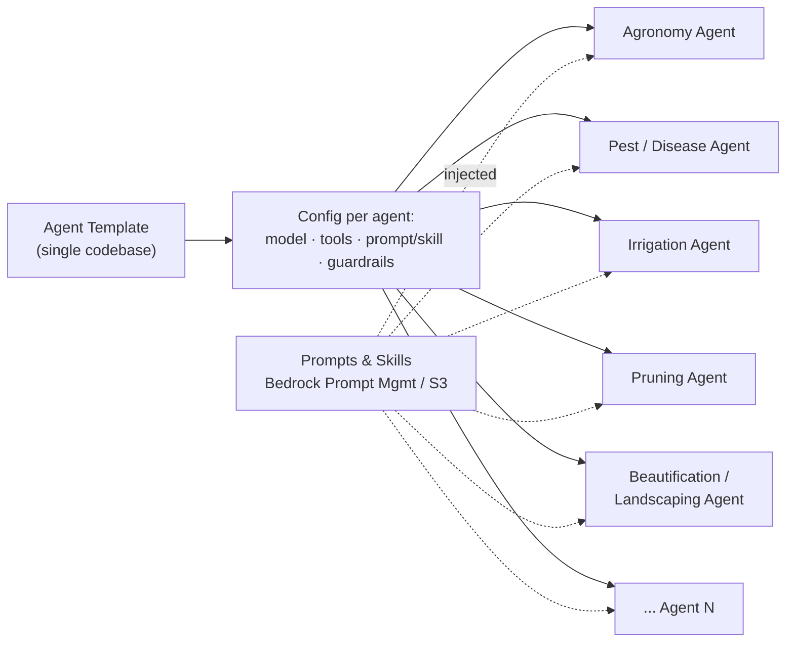
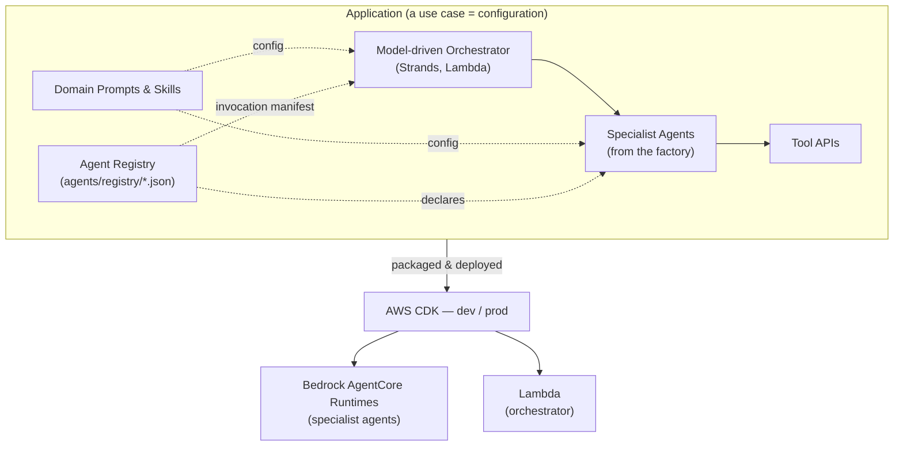
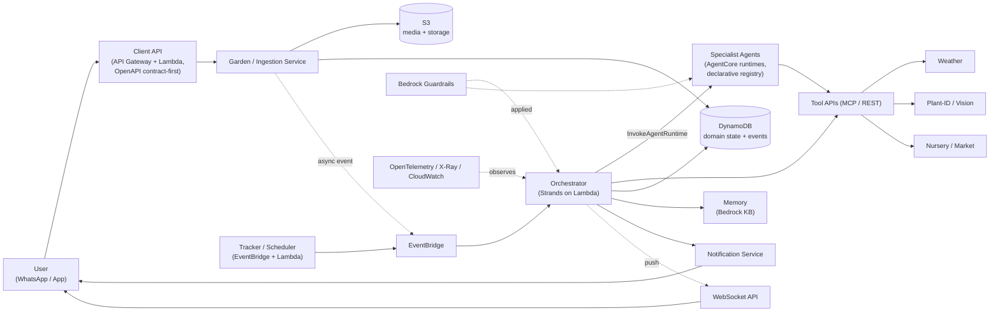
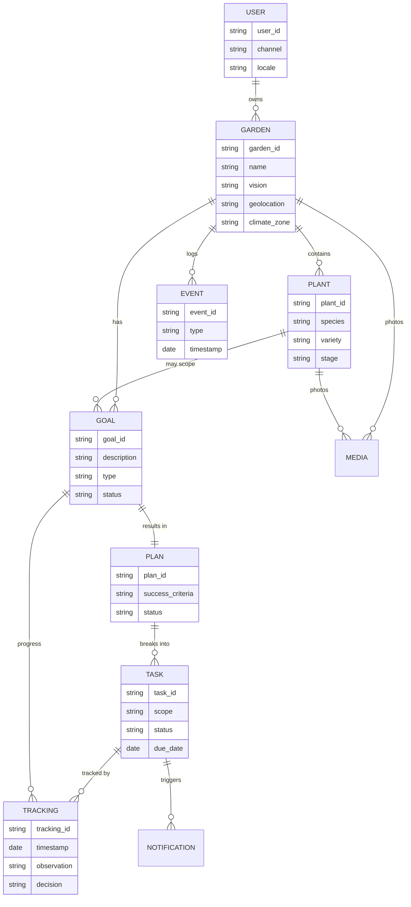
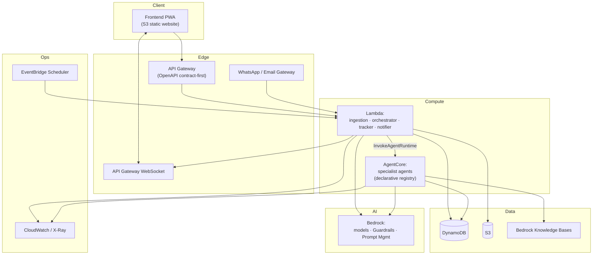
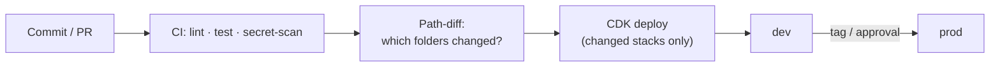
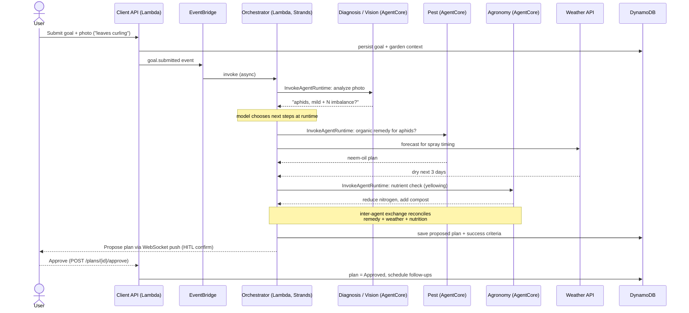
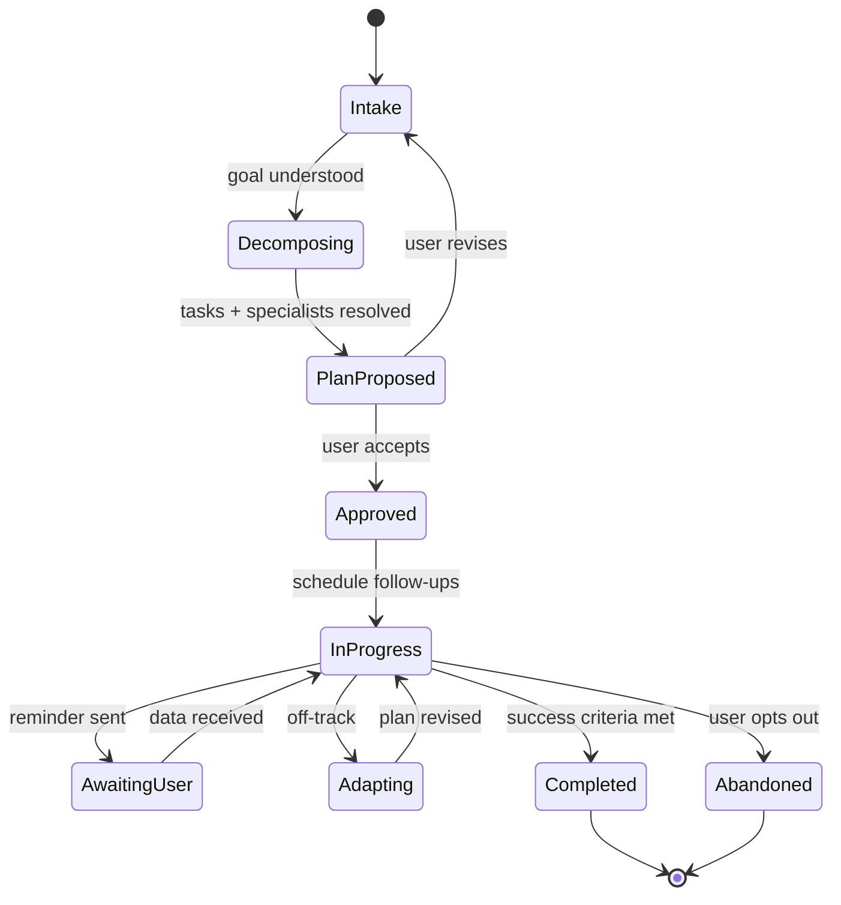

# Tendril — Architecture

This document describes Tendril's **conceptual architecture** and its **engineering views**. Tendril is built in two layers — a domain-agnostic **framework** and a garden **application** built on it (see [`../project-context.md`](../project-context.md)). Key decisions are recorded as ADRs in [`./ADRs/`](./ADRs/).

---

## 1. Concept Architecture

### 1.1 Build-time: Template → Agent → Application

A single **Agent Template** (one codebase) is specialized into many agents purely by **configuration** — model, tools, prompt/skill, guardrails, memory, and context settings. Prompts and skills live outside the code in **Bedrock Prompt Management / S3**, so each specialty can be authored and versioned independently by its domain expert.



The specialized agents, the model-driven orchestrator, the tool bindings, and the domain prompts are composed into an **Application** and deployed via **AWS CDK** to **dev** and **prod**.



Which specialist agents exist is **declarative, deploy-time configuration** — a JSON file per
agent in `agents/registry/` (same policy-as-data convention as `guardrails/*.json` and
`prompts/*.md`), read by CDK to provision AgentCore runtimes *and* by the orchestrator to build
its invocation manifest, so the two can never disagree (see [ADR-0012](./ADRs/0012-orchestrator-lambda-declarative-agent-registry.md)).

### 1.2 Runtime: model-driven composition

At runtime there is **no fixed execution order**. The orchestrator (Strands) decides, per request and garden context, which specialists and tools to invoke and in what sequence; specialists exchange information to reach the best course of action.



The orchestrator is **Lambda-hosted and async, event-triggered** — it runs off the Client API's
request path (matching ADR-0004's push-based design for long-running agent work), not on
AgentCore. Specialist agents remain on AgentCore, invoked dynamically by the orchestrator's
Strands agent loop via `InvokeAgentRuntime` (see [ADR-0012](./ADRs/0012-orchestrator-lambda-declarative-agent-registry.md)).

---

## 2. Application Domain Model

The user's world is a small set of entities. DynamoDB is the structured source of truth (see [ADR-0002](./ADRs/0002-context-management-and-durable-state.md)).



- **Scope of a Task** is either **plant-level** or **garden-level** (part or whole garden).
- **EVENT** is the capture-first log that feeds the future data flywheel.

---

## 3. Services

| Service | Responsibility | Tech | Deploy target |
|---------|----------------|------|---------------|
| **Client API** | User-facing entry: gardens, plants, photos, goals, plan approval, status — **OpenAPI 3.x contract-first** ([ADR-0011](./ADRs/0011-openapi-contract-first-client-api.md)) | API Gateway + Lambda | Lambda |
| **Garden / Ingestion** | Create/describe gardens; accept photos & metadata; build initial context; emits async events | Lambda + S3 | Lambda |
| **Orchestrator** | Model-driven decomposition & composition of specialists/tools; async, event-triggered ([ADR-0012](./ADRs/0012-orchestrator-lambda-declarative-agent-registry.md)) | Strands | **Lambda** |
| **Specialist Agents** | Domain expertise (agronomy, pest, disease, irrigation, fertilizer, pruning, weather, beautification, landscaping); declared in `agents/registry/*.json` | Strands (factory) | AgentCore |
| **Tracker / Scheduler** | Drive the outcome loop: due follow-ups, reminders, re-evaluation | EventBridge + Lambda | Lambda |
| **Notification** | Outbound reminders & inbound replies (WhatsApp / email) | Lambda + provider | Lambda |
| **Media / Vision** | Plant-ID and photo diagnosis (specialized model or API tool) | Bedrock / external model | Tool API |
| **Memory / Knowledge** | Semantic garden history & horticultural knowledge | Bedrock Knowledge Bases | Managed |
| **Persistence** | Structured domain state + event log | DynamoDB | Managed |
| **Frontend** | Angular PWA — 6 screens behind a responsive shell ([ADR-0003](./ADRs/0003-frontend-angular-and-design-system.md), §8 below) | Angular | S3 static website ([ADR-0010](./ADRs/0010-frontend-hosting-s3-static-website.md)) |

---

## 4. APIs

### 4.1 Client API (user-facing)

Defined **contract-first** in OpenAPI 3.x ([ADR-0011](./ADRs/0011-openapi-contract-first-client-api.md)) —
`app/api/openapi.yaml` is the source of truth; API Gateway (`SpecRestApi`) is provisioned by
importing it directly, and the frontend's TypeScript types are generated from the same file.

| Endpoint | Method | Purpose |
|----------|--------|---------|
| `/gardens` | POST | Create a named garden (vision, geolocation) |
| `/gardens/{id}` | GET/PATCH | Read/update garden context |
| `/gardens/{id}/plants` | POST/GET | Add / list plants (with photos) |
| `/gardens/{id}/media` | POST | Upload a plant/garden photo |
| `/gardens/{id}/goals` | POST | Submit a concern / expectation / wish |
| `/plans/{id}/approve` | POST | Human-in-the-loop plan approval |
| `/gardens/{id}/tasks` | POST/GET | Create / list plant- or garden-level tasks |
| `/gardens/{id}/status` | GET | Progress, upcoming follow-ups, history |

### 4.2 Tool APIs (agent-facing, "tools are APIs")

| Tool | Purpose | Consumer |
|------|---------|----------|
| Weather | Forecast & climate for the garden's geolocation | Orchestrator, weather/irrigation/pruning agents |
| Plant-ID / Vision | Species ID and disease/pest diagnosis from photos | Diagnosis agent |
| Nursery / Market | Availability & prices of inputs/plants | Landscaping / procurement |
| Notification | Send reminders, collect replies | Tracker, orchestrator |
| Knowledge search | Retrieve grounded horticultural references | All specialists |

All tools sit behind a uniform contract (MCP / REST) so they are discoverable and swappable.

### 4.3 Orchestrator ↔ Specialist invocation

Specialists aren't called over a conventional network API — each one is exposed to the
orchestrator's Strands agent loop as an **agent-as-tool**, whose implementation calls AgentCore's
`InvokeAgentRuntime` against that specialist's deployed runtime
([ADR-0012](./ADRs/0012-orchestrator-lambda-declarative-agent-registry.md)). *Which* specialists
exist is declared in `agents/registry/*.json` — read by `AgentCoreStack` to provision runtimes
and by the orchestrator to build its invocation manifest at deploy time, so provisioning and
invocation can never drift apart. *Which* of the declared specialists the model actually calls,
and in what order, is still decided at runtime — the declarative part is existence, not
sequencing (ADR-0001's "no fixed execution order" is unchanged).

---

## 5. Configurability

The framework's value is that behavior is **configuration**, not code.

| Configurable | Where | Examples |
|--------------|-------|----------|
| **Agent specialization** | `cdk.json` / env + Bedrock Prompt Management | model id, tool list, prompt/skill, guardrail, memory & context settings |
| **Agent registry** | `agents/registry/*.json` | which specialist agents are deployed, their AgentCore runtime name, and the tool description the orchestrator's model sees ([ADR-0012](./ADRs/0012-orchestrator-lambda-declarative-agent-registry.md)) |
| **Application composition** | App config | tool bindings, orchestrator policy, persona/context weighting |
| **API contract** | `app/api/openapi.yaml` | Client API request/response shapes, generated frontend types ([ADR-0011](./ADRs/0011-openapi-contract-first-client-api.md)) |
| **Prompts & skills** | Bedrock Prompt Management / S3 | authored & versioned per specialty by domain experts |
| **Guardrails** | Bedrock Guardrails | domain safety, content, PII policies |
| **Environment** | CDK context | `dev` / `prod` names, accounts, regions, removal policies |
| **Model per agent** | Agent config | Claude for reasoning; specialized vision model for diagnosis (see [ADR-0001](./ADRs/0001-use-strands-agents-framework.md)) |

Adding a specialty = a new prompt + a config entry. Adding a use case = a new configuration bundle; the engine is unchanged.

---

## 6. Engineering Views

### 6.1 Deployment view



Orchestrator and specialists are separate compute targets: **Lambda** (ingestion, orchestrator,
tracker, notifier) calls **AgentCore** (specialist agents only) via `InvokeAgentRuntime`
([ADR-0012](./ADRs/0012-orchestrator-lambda-declarative-agent-registry.md)).

### 6.2 Delivery view (GitOps + selective deploy)

Monorepo; CI detects changed folders and deploys **only** those via CDK; `main` is deployable; CI authenticates to AWS via OIDC (no static keys). Serverless-only for a NoOps posture. Details in [`../engineering-best-practices.md`](../engineering-best-practices.md).



### 6.3 Cross-cutting concerns

- **Security:** IAM roles (no long-lived keys), secrets in Secrets Manager/SSM, Bedrock Guardrails, least-privilege tool permissions. The orchestrator's execution role is scoped to `bedrock-agentcore:InvokeAgentRuntime` on registered specialist runtime ARNs only.
- **Observability:** built-in OpenTelemetry + X-Ray traces; CloudWatch for tool latency, token/cost, and error rates.
- **Multi-tenancy:** memory/storage stores and DynamoDB keys scoped per user/garden.
- **Data & privacy:** capture-first event log with privacy-by-design (consent, PII minimization, retention/TTL).
- **Contract governance:** the Client API contract (`app/api/openapi.yaml`) and the agent registry (`agents/registry/*.json`) are both **data, not code** — reviewed in PRs the same way guardrails and prompts already are ([ADR-0011](./ADRs/0011-openapi-contract-first-client-api.md), [ADR-0012](./ADRs/0012-orchestrator-lambda-declarative-agent-registry.md)).

---

## 7. Use-Case Views (dynamic workflow & state)

### 7.1 Goal intake → dynamic decomposition → plan approval

No predefined order; the model composes the path and specialists exchange information.



### 7.2 Long-running tracking loop (pause / resume across sessions)

```mermaid
sequenceDiagram
  participant Sched as Tracker / Scheduler (Lambda)
  participant EB as EventBridge
  participant Orch as Orchestrator (Lambda, Strands)
  participant State as DynamoDB
  participant Notif as Notification
  actor User
  Sched->>EB: follow-up due (plan X)
  EB->>Orch: invoke (async)
  Orch->>State: load plan, progress, success criteria
  Orch->>Notif: "Send a photo of the new leaves"
  Notif->>User: WhatsApp reminder
  Note over Orch: invocation ends — Lambda is stateless;<br/>next invoke reloads context from DynamoDB
  User->>Notif: replies with a photo
  Notif->>EB: reply.received event
  EB->>Orch: invoke (async, resume context from DynamoDB)
  Orch->>Orch: re-evaluate vs success criteria
  alt Improved
    Orch->>State: mark milestone / complete
    Orch->>Notif: "Great progress!"
  else Not improved
    Orch->>State: adapt plan
    Orch->>Notif: revised guidance
  end
```

### 7.3 Goal / Plan lifecycle (states)



---

## 8. Frontend

The Angular PWA ([ADR-0003](./ADRs/0003-frontend-angular-and-design-system.md)) implements the
"Tendril App" design across 6 routed screens behind a responsive shell, deployed as a static
site ([ADR-0010](./ADRs/0010-frontend-hosting-s3-static-website.md)).

### 8.1 Screens & shell

| Screen | Route | Purpose |
|---|---|---|
| Home | `/home` | Proposal banner (pending plan), today's tasks, goals in progress, plants strip |
| Capture / Diagnose | `/capture` | Photo capture placeholder → simulated specialist analysis → findings + generated goal |
| Goal detail | `/goals/:goalId` | Plan approval (HITL), collapsible agent decision trace, plan tasks, follow-up schedule |
| Tasks | `/tasks` | Grouped Today / This week / Later task lists |
| Garden | `/garden` | Garden facts + full plant list |
| Activity | `/activity` | Event timeline (the EVENT entity, §2) |

Desktop (≥900px) gets a persistent nav rail; narrower viewports get a bottom tab bar with a
floating capture action — one `LayoutService` breakpoint
(`frontend/src/app/core/services/layout.service.ts`) drives both, via Angular CDK's
`BreakpointObserver`.

### 8.2 Data layer seam

Every screen reads through a small set of DI-swappable service interfaces
(`GardenApi`/`GoalApi`/`TaskApi`/`ActivityApi` in `frontend/src/app/core/services/`), currently
bound to in-memory `Mock*Api` implementations (`app.config.ts`). This is the seam
[ADR-0011](./ADRs/0011-openapi-contract-first-client-api.md)'s OpenAPI-generated types and a real
`Http*Api` implementation plug into — no component changes required when the Client API lands.

### 8.3 Design system

Tokens (`frontend/src/app/styles/_tokens.scss`) are CSS custom properties — light theme only for
now (dark theme, per ADR-0003, is roadmap). Angular Material/CDK are used for primitives
(`BreakpointObserver`, a11y) rather than restyled visual components; the visual design is custom,
matching the source design mockup.

### 8.4 Hosting

Static build (`ng build`) synced to S3 static website hosting on every push touching
`frontend/**` ([ADR-0010](./ADRs/0010-frontend-hosting-s3-static-website.md)) — plain HTTP for
now, so the PWA service worker doesn't register in production yet (a known, accepted trade-off;
CloudFront is the documented upgrade path).

---

## 9. Related documents

- Concept & vision: [`../project-context.md`](../project-context.md)
- Engineering standards: [`../engineering-best-practices.md`](../engineering-best-practices.md)
- Decisions: [ADR-0001 (framework)](./ADRs/0001-use-strands-agents-framework.md), [ADR-0002 (context & state)](./ADRs/0002-context-management-and-durable-state.md), [ADR-0003 (frontend)](./ADRs/0003-frontend-angular-and-design-system.md), [ADR-0004 (backend API)](./ADRs/0004-backend-api-serverless-storage.md), [ADR-0005 (AgentCore deploy)](./ADRs/0005-agentcore-deployment-via-cdk.md), [ADR-0009 (AWS Agent Toolkit dev tooling)](./ADRs/0009-aws-agent-toolkit-dev-tooling.md), [ADR-0010 (frontend hosting)](./ADRs/0010-frontend-hosting-s3-static-website.md), [ADR-0011 (OpenAPI contract-first)](./ADRs/0011-openapi-contract-first-client-api.md), [ADR-0012 (orchestrator + agent registry)](./ADRs/0012-orchestrator-lambda-declarative-agent-registry.md)
