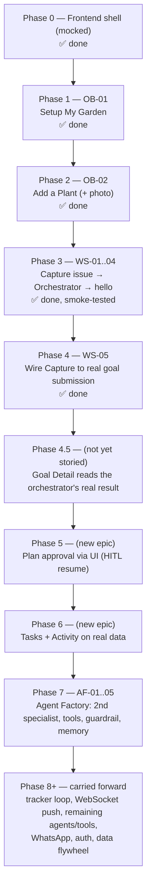

# Tendril — Development Roadmap (UI-first, incremental)

**Approach (decided 2026-09-12):** ship one **complete, demoable, tested vertical slice**
(UI → API → Lambda → data) at a time, starting from the simplest possible feature and adding
complexity only once the previous slice works end-to-end in `dev`. This is a **feature-first**
sequencing, not the **layer-first** sequencing the Walking Skeleton epic (`docs/stories/walking-skeleton.md`)
was originally written in (contract for everything → infra for everything → Lambda for
everything → orchestrator → frontend last). WS-01..WS-05's acceptance criteria and tasks are
still the right detail to build from — they're just consumed in a different order, with a couple
of scope adjustments noted below (§3).

This map exists to answer "what do we build next, and what does 'done' mean for it" at a glance.
It doesn't replace the story files — it sequences them.

---

## 1. Phase map

| Phase | Feature | New or existing story | UI | API operation(s) | Lambda | Data touched | Orchestrator/Agents involved? |
|---|---|---|---|---|---|---|---|
| **0** | Frontend shell + all 6 screens (mocked), architecture/ADRs, story epics | — | ✅ done | — | — | — | No |
| **1** | **Setup My Garden** | **OB-01** — ✅ done, verified end-to-end in dev | New `/garden-setup` screen | `POST /gardens`, `GET /gardens/{id}` | First `ClientApiStack` + garden handler | `AppTable`: Garden (canonical + ownership index) | No |
| **2** | **Add a Plant (with a photo)** | **OB-02** — ✅ done, verified end-to-end in dev (real photo landed in S3, Plant+Media linked) | Garden screen gains "Add plant"; new camera/file-picker component | `POST /gardens/{id}/media`, `POST /gardens/{id}/plants` | Presigned-upload + plant-create handlers | `AppTable`: Plant, Media; `MediaBucket` | No |
| **3** | **Capture an issue → orchestrator triggered** | **WS-01..WS-04** — ✅ done, smoke-tested against dev (found + fixed a real IAM gap — see WS-04) | Capture screen submits goal text — built in Phase 4 (WS-05) below | `POST /gardens/{id}/goals` (media op already existed from Phase 2) | Goal-intake handler; **Orchestrator** Lambda (lives in `AgentCoreStack`, not a separate stack — see WS-02's implementation note) | `AppTable`: Goal; EventBridge `goal.submitted`; `agents/registry/hello.json` | **Yes** — first orchestrator invocation, calling the `hello` stand-in specialist |
| **4** | **Wire Capture to real goal submission** | **WS-05** — ✅ done | Capture screen (photo optional, reusing OB-02's `PhotoPickerComponent`) submits a real issue via `createGoal`; shows a real "submitted" pending state, not the old simulated analyzing/found timeline (deleted, not repurposed) | `POST /gardens/{id}/goals` (already exists) | — | writes `AppTable`: Goal | Indirectly (triggers Phase 3's orchestrator) |
| **4.5** | *(not yet storied)* Goal Detail reads the orchestrator's real result | — | Goal Detail shows a real goal/plan once the orchestrator has produced one, instead of `MockGoalApi`'s fixture | `GET /gardens/{id}/status` (or a lighter goal-read op) — doesn't exist yet | Read handler | reads `AppTable` | Indirectly (displays orchestrator output) |
| **5** | **Plan approval via UI (HITL)** | *not yet storied* (new epic to write when we get here) | Goal Detail's existing "Review plan" / approve button, made real | `POST /plans/{id}/approve` | Approve handler; resumes the **Orchestrator** via `plan.approval.responded` | `AppTable`: Plan status; orchestrator session resume (`SnapshotSessionManager`, keyed by `goal_id`, data-architecture.md §3.1) | Yes — first HITL interrupt/resume round-trip |
| **6** | **Tasks & Activity on real data** | *not yet storied* | Tasks/Activity screens replace `MockTaskApi`/`MockActivityApi` | `GET /gardens/{id}/tasks`, event-log read | Read handlers | `AppTable`: Task, Event | No |
| **7** | **Agent Factory** — second specialist + first real Tool API + guardrail + memory | **AF-01..AF-05** (existing) | none (backend-only) | — | `AgentCoreStack` registry loop; `tools/weather/` | `agents/registry/agronomy.json`; two Bedrock Knowledge Bases (data-architecture.md §3.2) | Yes — proves the factory scales past one agent |
| **8+** | Carried forward | tracker/outcome loop, WebSocket live push, remaining 7 specialists + 4 tools, WhatsApp (deprioritized), Cognito auth, aggregated-data flywheel | — | — | — | — | — |

## 2. Definition of "increment done" (applies to every phase)

- **Frontend:** the real UI is wired to a real endpoint for that flow — no `Mock*Api` left in the
  path being demoed; component tests pass.
- **Backend:** Lambda + its CDK stack change deploy cleanly to `dev`; unit tests + CDK assertion
  tests pass.
- **End-to-end:** a manual smoke test against `dev` is performed and its result recorded in the
  story (matching the pattern already used in WS-04/AF's "manual smoke test recorded" criteria).
- **Docs:** the story's checkboxes are ticked; `docs/backlog.md`'s rank/status is updated.
- The full [Definition of Done](../engineering-best-practices.md) applies throughout (CI green,
  no hardcoded secrets, selective deploy, docs updated, human-reviewed) — this map doesn't relax
  it, just says *when* each piece of it gets exercised.

## 3. Resequencing notes (how this reorders what's already written)

- **`ClientApiStack` now stands up in Phase 1 (OB-01)**, not WS-02. Every later phase that adds a
  Client API operation (OB-02, WS-01, Phase 5, Phase 6) is adding to that same stack, never
  creating a new one.
- **The presigned media-upload operation (`POST /gardens/{id}/media`) now belongs to Phase 2
  (OB-02)**, not WS-01. WS-01's scope shrinks to just the goal-intake contract
  (`POST /gardens/{id}/goals`) when Phase 3 is picked up — the media op already exists by then.
- **The camera-capture-or-file-picker UI component is built once, in Phase 2 (OB-02)**, and
  reused by WS-05's Capture screen in Phase 3/4 — not built twice.
- WS-02's scope (EventBridge trigger, orchestrator infra, the declarative agent registry) is
  unchanged — it's still the right detailed story for Phase 3, just picked up after OB-01/OB-02
  instead of right after WS-01.
- Phases 5 and 6 are genuinely new — flagged as "not yet storied" rather than invented in detail
  here, so they don't get speculative acceptance criteria written before Phase 4 has even shipped
  and taught us something. Write them (matching the existing `As a/I want/so that` + AC + Tasks
  format) when Phase 4 is done.

## 4. What to build right now

**(2026-09-12 update)** Phases 1-4 (OB-01/02, WS-01..05) are all done and smoke-tested against
`dev` — the full pipe (photo/issue in → Client API → EventBridge → orchestrator → `hello` via
`InvokeAgentRuntime` → result written back) is proven end-to-end, including finding and fixing a
real IAM gap (AgentCore authorizes `InvokeAgentRuntime` against the runtime-*endpoint*
sub-resource, not the bare runtime ARN — see WS-04). Next up: **Phase 4.5** (not yet storied —
write it once it's picked up) — Goal Detail reading the orchestrator's real result instead of
`MockGoalApi`'s fixture — or jump ahead to **Phase 7 (AF-01..05, Agent Factory)** to prove the
registry/template pattern scales past one specialist. Either is a reasonable next pick; ask
before assuming which.

## 5. Related documents

- [`docs/stories/garden-onboarding.md`](./stories/garden-onboarding.md) — OB-01, OB-02 (Phases 1-2)
- [`docs/stories/walking-skeleton.md`](./stories/walking-skeleton.md) — WS-01..05 (Phases 3-4, scope-adjusted per §3)
- [`docs/stories/agent-factory.md`](./stories/agent-factory.md) — AF-01..05 (Phase 7)
- [`docs/architecture/data-architecture.md`](./architecture/data-architecture.md) — entity/key design every phase writes against
- [`docs/backlog.md`](./backlog.md) — the ranked, single source of truth this map sequences
